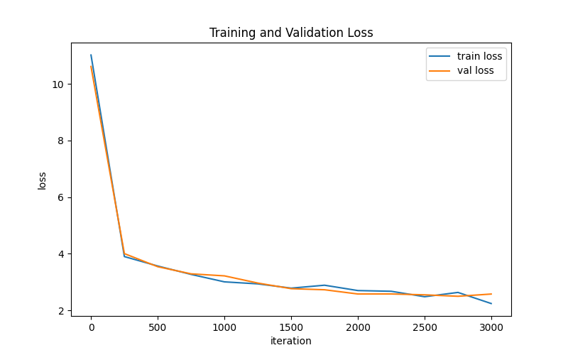

# Small Language Model (SLM) from Scratch — TinyStories

## Objective
This project builds a small decoder-only Transformer language model from scratch and trains it on the TinyStories dataset, covering the full pipeline: data loading, BPE tokenization, model architecture, training, evaluation, and text generation.

## Dataset
- Dataset: [TinyStories](https://huggingface.co/datasets/roneneldan/TinyStories) (roneneldan/TinyStories on Hugging Face)
- Full dataset: 2,119,719 training stories, 21,990 validation stories
- Used a subset for training within the project timeline: 200,000 training stories, 2,000 validation stories

## Tokenization
- BPE tokenization via `tiktoken`, using the GPT-2 vocabulary (50,257 tokens)
- Tokens stored as memory-mapped `uint16` binary files for efficient random-access loading during training
- `train.bin`: 44,970,964 tokens (89.9 MB)
- `val.bin`: 389,121 tokens (0.8 MB)

## Model Architecture
Decoder-only Transformer (GPT-style):
- 6 transformer blocks
- 6 attention heads
- 384 embedding dimension
- 256 token context window (block size)
- Causal self-attention + feed-forward (MLP) layers with residual connections and layer normalization

## Training
- Optimizer: AdamW, learning rate 3e-4, weight decay 0.1
- Batch size: 32, block size: 256, iterations: 3000
- Hardware: Google Colab, T4 GPU
- Final validation loss: 2.4170
- Perplexity: 11.21

## Sample Generations
*(paste 2-3 of your best examples from sample_generations.txt here)*

## Experiments: Sampling Strategy Comparison
*(paste your write-up comparing temperature/top_k settings from sampling_comparison.txt here)*

## Key Learnings and Challenges
- *(3-5 honest bullet points about what was tricky or interesting)*

## How to Reproduce
1. Open `notebooks/slm_build.ipynb` in Google Colab
2. Runtime → Change runtime type → T4 GPU
3. Run all cells in order (Runtime → Run all)

## References
- Eldan & Li (2023), "TinyStories: How Small Can Language Models Be and Still Speak Coherent English?", arXiv:2305.07759
- Karpathy, nanoGPT (GitHub)
